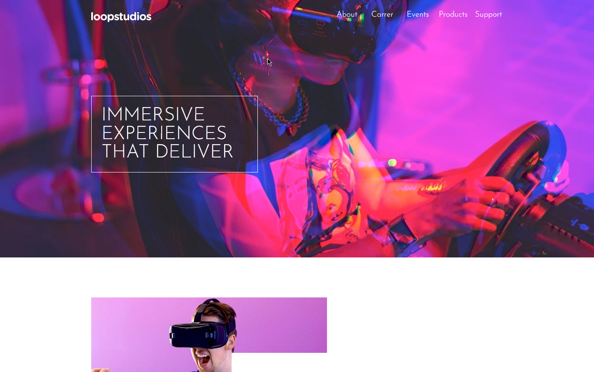

# Frontend Mentor - Loopstudios landing page

## Welcome! 👋

Thanks for checking out this front-end coding challenge.

[Frontend Mentor](https://www.frontendmentor.io) challenges help you improve your coding skills by building realistic projects.

**To do this challenge, you need a good understanding of HTML and CSS and a basic understanding of JavaScript.**

## The challenge

Your challenge is to build out this landing page and get it looking as close to the design as possible.

This challenge focuses mostly on HTML & CSS. There's a tiny bit of JS included for the mobile navigation toggle. But you could also choose to do this without JS!

You can use any tools you like to help you complete the challenge. So if you've got something you'd like to practice, feel free to give it a go.

Your users should be able to:

- View the optimal layout for the site depending on their device's screen size
- See hover states for all interactive elements on the page

Want some support on the challenge? [Join our Slack community](https://www.frontendmentor.io/slack) and ask questions in the **#help** channel.

## Overview

### The challenge

Users should be able to:

- Fill in the form and see the card details update in real-time
- Receive error messages when the form is submitted if:
  - Any input field is empty
  - The card number, expiry date, or CVC fields are in the wrong format
- View the optimal layout depending on their device's screen size
- See hover, active, and focus states for interactive elements on the page

### Screenshot

    
    
    

    
    

### Links

- Source Code URL: [Source Github](https://github.com/lenez12/loopstudios-landing-page-main.git)
- Live Site URL: [Demo Live](https://lenez-loopstudios.netlify.app/)

## My process

### Built with

- Semantic HTML5 markup
- CSS custom properties
- Flexbox
- CSS Grid
- JQuery
- JQuery Masking Input

### What I learned

what I learned in making this challenge is:

1. using css grid to create template area
2. using css grid and media query to create responsive mobile
3. manipulate DOM using javascript using looping elemet
4. chage navigation position

### Continued development

1. In the future I will make a good css class naming name
2. add animation and transition when hover and activate

### Useful resources

- [W3Schools](https://www.w3schools.com/howto/howto_css_center-vertical.asp)
- [Reset CSS](https://piccalil.li/blog/a-modern-css-reset/)
- [Event in DOM](https://developer.mozilla.org/en-US/docs/Web/API/HTMLElement/change_event)
- [Pattern on input](https://www.aleksandrhovhannisyan.com/blog/html-input-validation-without-a-form/)
- [Validation Html DOM](https://dev.to/javascriptacademy/form-validation-using-javascript-34je)

## Author

- Frontend Mentor - [@Lenez](https://www.frontendmentor.io/profile/yourusername)
- Twitter - [@prak_tech](https://www.twitter.com/prak_tech)

